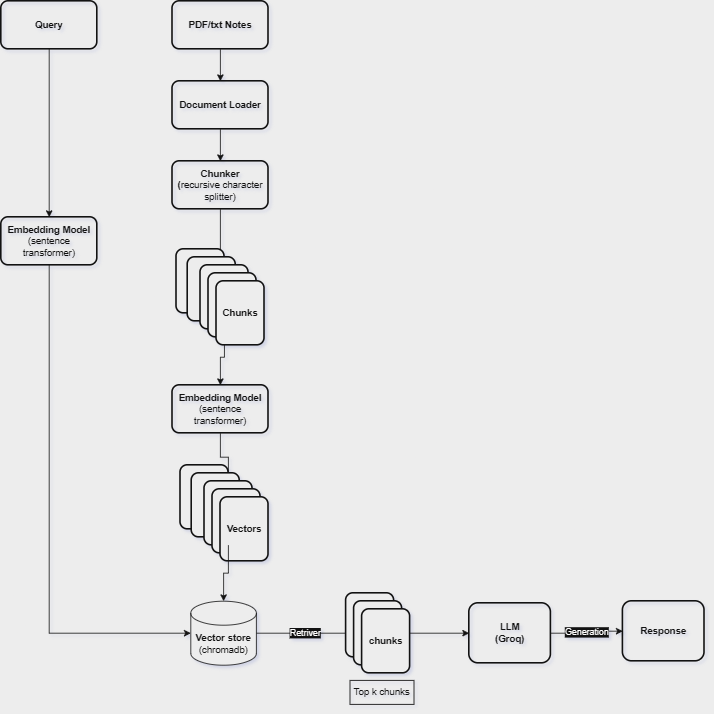

# AI Notes Assistant

A Retrieval-Augmented Generation (RAG) application that allows users to upload a PDF document and ask natural language questions about its content. The system combines semantic search, keyword search, and a Large Language Model (LLM) to provide accurate, context-aware answers grounded in the uploaded document.

## Features

- Upload PDF documents
- Extract and process document content
- Recursive text chunking
- Vector-based semantic retrieval using ChromaDB
- Keyword retrieval using BM25
- Hybrid retrieval (Semantic + Keyword Search)
- LLM-powered answer generation using Groq
- Simple Streamlit web interface
- Environment variable support using `.env`

## Project Architecture



## Installation

### 1. Clone the Repository
```bash
git clone https://github.com/Samundra9999/AI-Notes-Assistant.git
cd AI-Notes-Assistant
```

### 2. Create Virtual Environment
```bash
uv venv
```
Activate environment:
- Windows
```bash
.venv\Scripts\activate
```
- Mac/Linux
```bash
source .venv/bin/activate
```
### 3. Install Dependencies
- Using UV:
```bash
uv sync
```
- OR using pip:
```bash
pip install -r requirements.txt
```  
## Environment Variables
Create a .env file in the project root:
```bash
GROQ_API_KEY=your_groq_api_key
```  
## Running the Application
```bash
streamlit run main.py
```  

## Usage
- Launch the Streamlit application.
- Upload a PDF document.
- Enter a question related to the document.
- Click Submit.
- The system retrieves relevant content and generates an answer using the LLM.

## Author

Samundra Bhandari

Aspiring AI/ML and Data Science Engineer.

